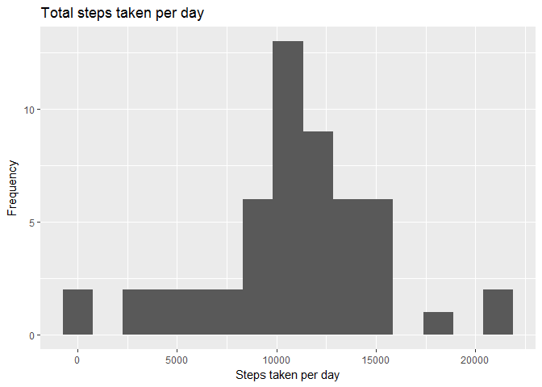

# Reproducible Research: Peer Assessment 1

The dplyr package is used to process the dataframes.
The lubridate package is used to handle date formats.
Plots are created using the ggplot2 package.

```r
library(dplyr)
library(lubridate)
library(ggplot2)
```


## Loading and preprocessing the data
The data is loaded from the csv file and is converted in the tbl format for use with the dplyr package.
The date column is converted to date class with function date of the the lubridate package.


```r
activity <- read.csv("activity.csv",sep=",")
activity <- tbl_df(activity)
activity$date <- date(activity$date)
```

## What is mean total number of steps taken per day?

Using the group_by and summarize functions of the dplyr package we calculate the total number of steps taken per day

```r
steps_per_day <- group_by(activity, date)
sum_stpd <- summarize(steps_per_day, stpd = sum(steps))
```
The histogram of the total steps taken per day is drawn with the ggplot2 package:

```r
g1 <- ggplot(sum_stpd, aes(stpd))
print(g1 + geom_histogram(bins=15) + labs(x = "Steps taken per day") + labs(y = "Frequency") + labs(title = "Total steps taken per day" ))
```

<!-- -->

We then calculate the mean and median number of steps taken per day:

```r
mean_stpd <- format(mean(sum_stpd$stpd, na.rm=TRUE),digits=2,big.mark = ",")
median_stpd <- format(median(sum_stpd$stpd, na.rm=TRUE),digits=2, big.mark = ",")
```
The mean number of steps taken per day is 10,766 while the median is 10,765. 

## What is the average daily activity pattern?

We now extract the average daily activity pattern, by calculating the average steps per interval across the total days.


```r
steps_per_interval <- group_by(activity, interval)
avg_stpint <- summarize(steps_per_interval, stpint = mean(steps, na.rm = TRUE))
```
The timeline is shown in the figure below:

```r
g2 <- ggplot(avg_stpint, aes(interval, stpint))
print(g2 + geom_line() + labs(x = "Time Interval") + labs(y = "Average number of steps") + labs(title = "Average number of steps taken per interval"))
```

<!-- -->

Caclulating the interval within the day that the average number of steps taken is largest:

```r
max_stpint <- max(avg_stpint$stpint)
max_which <- which.max(avg_stpint$stpint)
max_interval <- avg_stpint$interval[max_which]
```
The time interval within the day is at 8.35 and the maximum average number of steps is 206.1698113.

## Imputing missing values
The dataset that we used so far contains several missing values, as there are time intervals in certain days when ther was no activity.

```r
missing <- length(which(is.na(activity$steps)))
```
The total number of missing values is 2304.
To extend our analysis we will attempt to fill in these missing values. To do so, we will simply take the average number of steps taken per interval that we have already calculated.
We first find the missing rows:

```r
missing_matrix <- which(is.na(activity))
```
We then use as lookup table the table with the average number of steps taken per interval to fill in the missing values:

```r
missed <- filter(activity, is.na(steps))
joined <- inner_join(missed, avg_stpint)
activity_narm <- activity
activity_narm$steps[missing_matrix] <- joined$stpint
```

We now repeat the analysis performed earlier for the toal number of steps taken per day using this time the dataset with the missing values replaced.


```r
steps_per_day_narm <- group_by(activity_narm, date)
sum_stpd_narm <- summarize(steps_per_day_narm, stpd = sum(steps))
g3 <- ggplot(sum_stpd_narm, aes(stpd))
print(g3 + geom_histogram(bins=15) + labs(x = "Steps taken per day") + labs(y = "Frequency") + labs(title = "Total steps taken per day - missing valued removed" ))
```

<!-- -->

Again, we calculate the mean and median:

```r
mean_stpd_narm <- format(mean(sum_stpd_narm$stpd, na.rm=TRUE), digits = 2, big.mark = ",")
median_stpd_narm <- format(median(sum_stpd_narm$stpd, na.rm=TRUE),digits = 2, big.mark = ",")
```
The mean is 10,766 and the median is 10,766. We observe that the mean and median is practically equal with or without the missing values. The histogram shape is similar with the only difference that the frequencies are increased, whcih was expected since we have used more measurements.

## Are there differences in activity patterns between weekdays and weekends?
In the final step we introduce a new dimension in the analysis, to examine whether there is difference in activity patterns between weekdays and weekends. To do so, we introduce a new factor variable with two levels, Weekdays and Weekends:

```r
wdays <- c(2,3,4,5,6)
activity_narm <- mutate(activity_narm, isWeekday = if_else(wday(date) %in% wdays, "Weekdays", "Weekend"))
activity_narm$isWeekday <- as.factor(activity_narm$isWeekday)
```

We then plot again the timeline of the average number of steps taken per interval, for weekdays and wekeends:

```r
steps_per_interval_narm <- group_by(activity_narm, interval, isWeekday)
avg_stpint_narm <- summarize(steps_per_interval_narm, stpint = mean(steps, na.rm = TRUE))
g4 <- ggplot(avg_stpint_narm, aes(interval, stpint))
print(g4 + geom_line() + facet_grid(avg_stpint_narm$isWeekday~.) + labs(x = "Time Interval") + labs(y = "Average number of steps") + labs(title = "Average number of steps taken per interval"))
```

<!-- -->


